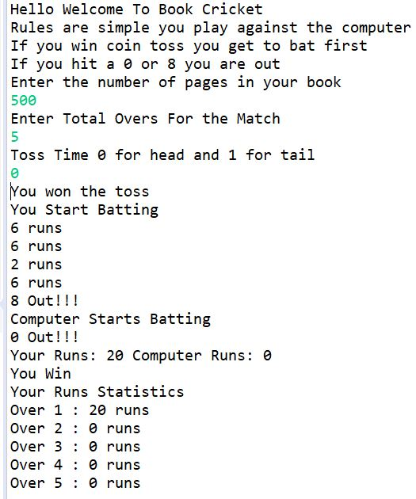
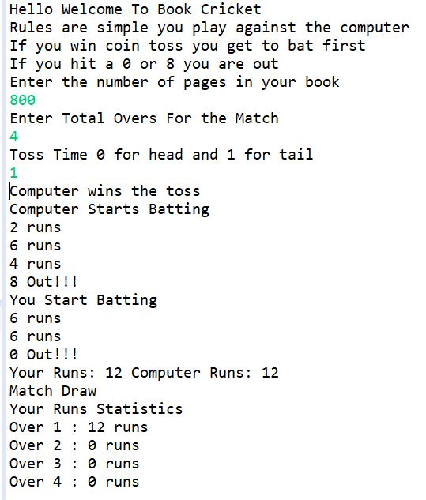

# BookCricket
A console book page flipping cricket game simulation program.

# About
It is a console simulaton for the famous book pages flipping cricket game. The objective is to flip the pages repeatedly and land on a page which has unit digit of the page number from the set {2, 4, 6} which will be the score added to previous scores if any and if the page number has unit digit from the set {0,8} then the player is out and the opponent now flips the book pages to score. The player with highest total score is the winner. 

# Features
1. User playes against the computer.
2. User can set the number of pages in the book and the number of overs to play.
3. Who gets to bat first is decided by a coin toss.
4. Ball by ball runs are displayed for both players.
5. Winner is displayed.
6. Runs per over summary is generated for the user.

# ScreenShots

# End Thoughts
This is a purely luck based simulation. Whether you win or loose is based on the random numbers generated by the SecureRandom Class of java.security package. So your fate is decided by a random number generating class of java which is fair as in real life also playing this game with a book is purely luck based. But we humans are intelligent. We can always get an idea of how many pages to flip to get good score after playing for sometime with a particular book!!!

